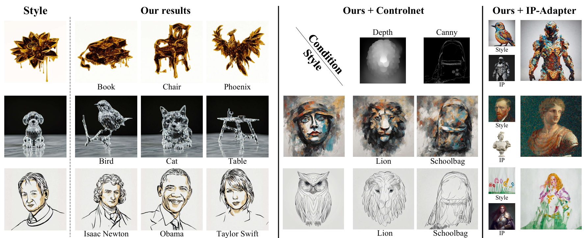

## SPG: Style-Prompting Guidance for Style-Specific Content Creation

<div align="center">
 <a href=''></a> &nbsp;&nbsp;
 <a href=''></a>
</div>
<br></br>
<!--  -->


**TL;DR:** A training free methods for style-specific text2image creation.

### ⚙️ Getting Started 

#### Steup
```
This code was tested with Python 3.10, Pytorch 2.5 and Diffusers 0.32.
```
### Inference
```
1.You can use the SPG.ipynb file to generate stylized images by combining CFG with SPG.
2.You can use the SPG+controlnet.ipynb file to add ControlNet constraints during the generation process.
3.You can add IPAdapter constraints during the generation process using the SPG+IPAdapter.ipynb file in the IPAdapter folder.
```

